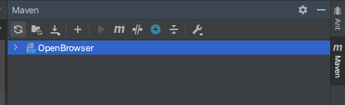

<h2> Open Browser Using Java Automation </h2>

---

<h3><b>For Apple Macbook User:</b></h3>

Platform supporting Maven: [IntelliJ IDEA CE](https://www.jetbrains.com/idea/download/download-thanks.html?platform=mac&code=IIC)

1. Create a new Project

2. Choose [Maven](https://en.wikipedia.org/wiki/Apache_Maven#:~:text=Maven%20is%20a%20build%20automation,%2C%20Scala%2C%20and%20other%20languages.&text=Maven%20is%20built%20using%20a,application%20controllable%20through%20standard%20input.)

3. In Project SDK box, make sure you have latest version of java "JDK"

<p align="center">

</p>

4. Click Next, and give a name to your project, like "OpenBrowser"

5. Since we are just testing the browsers, we don't need "main" folder inside "src". 

6. Now create a package inside src/java/ and name it "openChrome" then create a class inside it, name it "TestChrome"

7. Create a package inside src/java/ and name it "openFirefox" then create a class inside it, name it "TestFirefox"

8. Create a package inside src/java/ and name it "openSafari" then create a class inside it, name it "TestSafari"


<h4> What is Maven? </h4>

"Maven is a build automation tool used primarily for Java projects. Maven can also be used to build and manage projects written in C#, Ruby, Scala, and other languages.

Maven addresses two aspects of building software: how software is built, and its dependencies. An XML file describes the software project being built, its dependencies on other external modules and components, the build order, directories, and required plug-ins. It comes with pre-defined targets for performing certain well-defined tasks such as compilation of code and its packaging. 

Maven dynamically downloads Java libraries and Maven plug-ins from one or more repositories such as the Maven 2 Central Repository, and stores them in a local cache. Maven projects are configured using a Project Object Model, which is stored in a [pom.xml](https://github.com/kk289/Java-Automation-OpenBrowser/blob/master/OpenBrowser/pom.xml) file."

An example of [pom.xml](https://github.com/kk289/Java-Automation-OpenBrowser/blob/master/OpenBrowser/pom.xml) file looks like: 

```
<?xml version="1.0" encoding="UTF-8"?>
<project xmlns="http://maven.apache.org/POM/4.0.0"
         xmlns:xsi="http://www.w3.org/2001/XMLSchema-instance"
         xsi:schemaLocation="http://maven.apache.org/POM/4.0.0 http://maven.apache.org/xsd/maven-4.0.0.xsd">
    <modelVersion>4.0.0</modelVersion>

    <groupId>org.example</groupId>
    <artifactId>OpenBrowser</artifactId>
    <version>1.0-SNAPSHOT</version>

    <properties>
        <project.build.sourceEncoding>UTF-8</project.build.sourceEncoding>
        <maven.compiler.source>1.7</maven.compiler.source>
        <maven.compiler.target>1.7</maven.compiler.target>
    </properties>

    <dependencies>

        <!-- https://mvnrepository.com/artifact/junit/junit -->
        <dependency>
            <groupId>junit</groupId>
            <artifactId>junit</artifactId>
            <version>4.12</version>
            <scope>test</scope>
        </dependency>

        <!-- https://mvnrepository.com/artifact/io.github.bonigarcia/webdrivermanager -->
        <dependency>
            <groupId>io.github.bonigarcia</groupId>
            <artifactId>webdrivermanager</artifactId>
            <version>3.8.1</version>
            <scope>test</scope>
        </dependency>

        <!-- https://mvnrepository.com/artifact/org.seleniumhq.selenium/selenium-java -->
        <dependency>
            <groupId>org.seleniumhq.selenium</groupId>
            <artifactId>selenium-java</artifactId>
            <version>3.141.59</version>
            <scope>test</scope>
        </dependency>

        <!-- https://mvnrepository.com/artifact/org.seleniumhq.selenium/selenium-api -->
        <dependency>
            <groupId>org.seleniumhq.selenium</groupId>
            <artifactId>selenium-api</artifactId>
            <version>3.141.59</version>
            <scope>test</scope>
        </dependency>

    </dependencies>

</project>
```

9. Make sure to setup your "pom.xml" file like above. Just replace your pom.xml file with this [pom.xml](https://github.com/kk289/Java-Automation-OpenBrowser/blob/master/OpenBrowser/pom.xml)

<h3>Test Chrome Browser : Java Automation</h3>

Let's take a look at "TestChrome" class:

```
package openChrome;

import org.junit.Test;
import org.openqa.selenium.WebDriver;
import org.openqa.selenium.chrome.ChromeDriver;

public class TestChrome {

    @Test
    public void chromeBrowser() throws InterruptedException {

        System.setProperty("webdriver.chrome.driver", "/usr/local/bin/chromedriver");

        //WebDriverManager.chromedriver().setup();

        WebDriver wd = new ChromeDriver();
        wd.get("http://www.google.com");

        // Print a Log In message to the screen
        System.out.println("Successfully opened the website");

        // Maximize Browser
        wd.manage().window().maximize();

        // Wait for 5 sec
        Thread.sleep(5000);

        // Close
        wd.quit();
    }
}
```

Note: 

Since my Mac couldnot run selenium.WebDriver, I had to follow manual way. If "selenium.WebDriver" dependency doesn't work for your laptop, we can download the "chromedriver" manually from following website. But before that make sure to check what version of Google Chrome you are using right now. 

- Step 1:

To Check which version of Google Chrome you have: 


- Step 2:

Now you know what version of google chrome you are using, lets download "chromedriver". Go to following website: [Click Here](https://chromedriver.chromium.org/downloads)

Download the ChromeDriver based on your current version of Google Chrome.


Choose "chromedriver_mac64.zip"


- Step 3: 

Unzip the "chromedriver". Before I go further, take a look at this code from TestChrome class. 

```
System.setProperty("webdriver.chrome.driver", "/usr/local/bin/chromedriver");
```

Like I said before, I had to download chromedriver to run the program. "/usr/local/bin/chromedriver" is the location where I have placed my chromedriver. Or some laptop may have name it as "/user/local/bin/" or "/user/bin/". Make sure where is your bin folder in laptop.

Now either you can simply copy and paste the unzip chromedriver to the OpenBrowser project folder, like this: 


OR,

You can do as I did, placed in system. I strongly recommend you to keep in usr/local/bin/ folder which is inside laptop system. Later you are also going to do same for safari driver too.

<details>
	<summary><b> Click Here to Know How to Store "chromedriver" in /usr/local/bin/ of your Macbook using Terminal</b></summary>

1. Open Terminal


2. To Check where you are. Type: ls. It shows all files in current directory.


3. Find the folder where you have stored the "chromedriver" file. Since I have saved in Downloads folder, I will go there. To go to Downloads folder,
Type: cd Downloads and after that type: ls


Now you are inside Downloads folder. You can see "chromedriver" file there. 

4. Type: mv chromedriver /usr/local/bin  and then type: ls


Now there is no "chromedriver" file. It is already moved to /usr/local/bin/.

5. Type: cd /usr/local/bin and then type: ls


Now we are inside /usr/local/bin directory. If you have good eyesight, you can find "chromedriver" file there which is now stored in user system.

That's it. You successful moved "chromedriver" file to /usr/local/bin. 

If you have followed the above step, you can use my entire TestChrome class. No need to change anything. 

</details>

So far, we already setup "pom.xml" file, "TestChrome" class also. Let's Run the TestChrome File. If it is alright, your test class should pass. 


<details>
	<summary>Check Here: If you got any Error</summary>

Apple computers are so strict on running any third-party softwares or file. Here we are using chromedriver file which we downloaded from website. While running TestChrome class, you might have got this error: 


To solve this issue, 

1. First, Go to System Preferences. 


2. Click on "Security & Privacy"


3. Click on "Allow Anyway"


This is how we can able to use "chromedriver" file. Go back to the project and before running the TestChrome class, let's refresh our project by clicking the "Maven" which is on upper right side of our IntelliJ window. 


Now you can see refresh button like recycle type symbol there, click that, and your project is now refreshed.



You can run the TestChrome class. (Click "okay" if any window pop-up) And your test class should be passed now. 


</details>


---


<h3>Test Firefox Browser : Java Automation</h3>


<h3>Test Safari Browser : Java Automation</h3>